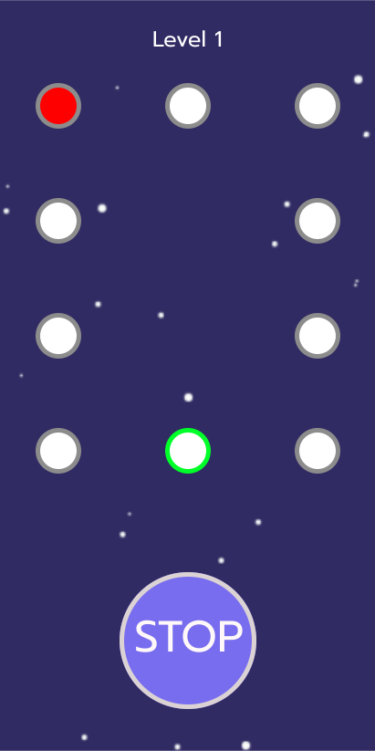

# gamofled

Um jogo simples feito totalmente em flutter.

## Objetivo

O objetivo do jogo é testar o quão rápido são os seus reflexos.

## Como funciona?

Tente capturar as bolinhas vermelhas no meio da verde através do botão “stop”.

Até que nível você consegue chegar?

 

